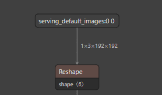
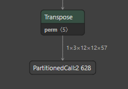
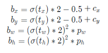

# <div align="center"> 模型输入输出的处理 </div>
[tflite推理代码参考](../tflite_detect.py)

在导出的tflite模型中，模型的输入是一张图片，以数组的形式，形状为[1, 3, 192, 192],
`1`代表一张图片，`3`代表图片的3通道，`192 192`分别是高和宽。
<div align="center">
    
    <p>使用netron打开tflite模型查看输入</p>
</div>

模型的输出，目前导出的是不带Detect层的模型，所以输出有三个，分别是不同尺度下的输出，
包括下采样4倍的输出[1, 3, 48, 48, 57], 下采样8倍的输出[1, 3, 24, 24, 57], 下采样16倍的输出[1, 3, 12, 12, 57]。

<div align="center">
    
    <p>下采样16倍的特征图输出</p>
</div>

模型输出形状的含义为，`1`表示一张图片，`3` 表示图片的三通道， `12 12` 表示该尺度下输出特征图的高宽，`57` 表示四个人体框中心坐标及高宽的**偏移量**+目标conf+1个人体类别+ 17个关键点的位置信息（x, y, conf)

### 输入预处理
输入读取一张图片
- BGR->RGB
- astype to float32
- resize to 192*192
- 归一化 img/255.0
- 增加一维度表示batch-size > shape=(1, 3, 192, 192)

### 输出后处理
[后处理代码参考](../utils/tflite3output_postprocess.py)

**必要的两个值**
> anchors = [[10, 13, 16, 30, 33, 23], [30, 61, 62, 45, 59, 119], [116, 90, 156, 198, 373, 326]]

> strides = [torch.tensor([4.]), torch.tensor([8.]), torch.tensor([16.])]

模型的输出是包含了多个尺度下（这里是三个）的输出特征图列表，如[(1,3,48,48,57), (1,3,24,24,57), (1,3,12,12,57)]。
遍历该列表，对每一个尺度下的特征图做处理，比如下采样4倍（192/48)的特征图（1，3，48，48，57），需要将该特征图的预测情况反应到原始图片（192*192）的图片上。

**输出解析** （1，3，48，48，57）
- `1`表示1张图片
- `3`表示特征图3通道
- `48 48`表示原本192\*192 的图片被下采样4倍到 48\*48，同时也表示当前特征图被划分为了48\*48的网格，每个网格是一个像素，大小为1*1，每个网格会用来确定目标信息，如果有不同的目标，即目标的大小不一样，则引入anchors来确定；
- `57`由四个偏移量t<sub>x</sub>, t<sub>y</sub>, t<sub>w</sub>, t<sub>h</sub>, + conf + 1个人体类别+17个关键点（由t<sub>x</sub>, t<sub>y</sub>, conf组成)

由偏移量，网格中心坐标，下采样倍数stride，和锚框的宽高，得到在原始图片上的预测框；公式如下
<div align="center">
    
    <p>c<sub>x</sub>, c<sub>y</sub>分别是当前网格的中心坐标</p>
    <p>p<sub>w</sub>, p<sub>h</sub>分别是当前网格对应的锚框的宽高</p>
</div>

代码如下：
```python
xy = (y[..., 0:2] * 2. - 0.5 + self.grid[i]) * self.stride[i]  # xy 通过偏移量，网格中心坐标得到边界框的坐标；注：偏移量在-0.5到1.5之间
wh = (y[..., 2:4] * 2) ** 2 * self.anchor_grid[i].view(1, self.na, 1, 1, 2) # wh
```
对于每个关键点（t<sub>x</sub>, t<sub>y</sub>, conf),其中t<sub>x</sub>, t<sub>y</sub>为关键点坐标的相对网格中心点的偏移量。
同样通过网格的中心坐标，stride得到关键点得绝对坐标；
```python
x_kpt[..., 0::3] = (x_kpt[..., ::3] * 2. - 0.5 + kpt_grid_x.repeat(1,1,1,1,17)) * self.stride[i]  # xy
x_kpt[..., 1::3] = (x_kpt[..., 1::3] * 2. - 0.5 + kpt_grid_y.repeat(1,1,1,1,17)) * self.stride[i]  # xy
x_kpt[..., 2::3] = x_kpt[..., 2::3].sigmoid()
```
